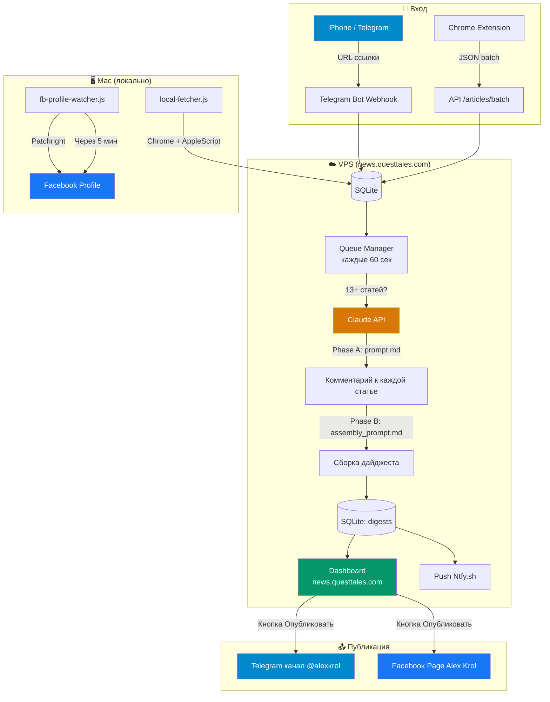
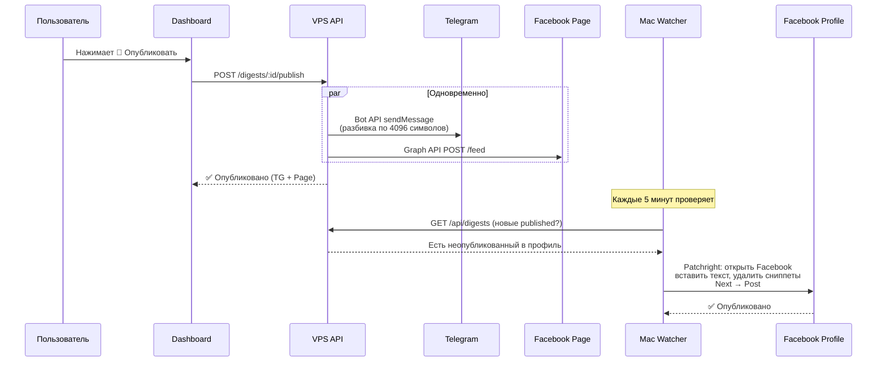
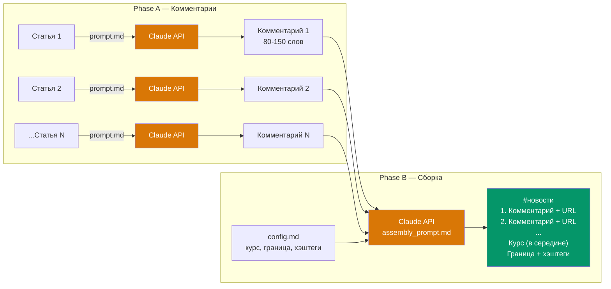

# News Digest Pipeline

[Пример готового дайджеста в Facebook](https://www.facebook.com/alex.v.krol/posts/pfbid02oj14ZFeSvyrrpcNN8dBJoJ6YsegA4gSeqtsSdhVMjkAYZU15aFuRH7msPN3EuE8al)

[Пример готового дайджеста в Telegram](https://t.me/alexkrol/8510)

[Пример готового дайджеста в Youtube](http://youtube.com/post/UgkxFs7bfPTzCMBtYq_UT2ttLd6TVNRenVRL?si=olNJLuQs_ZVqlarq)

Автоматизированный пайплайн для создания авторских новостных дайджестов на русском языке. Собирает статьи с Perplexity AI, генерирует ироничные комментарии через Claude API и публикует в Facebook, Telegram, YouTube.

## Архитектура

### Полный пайплайн



### Процесс публикации



### Генерация дайджеста (Claude API)



## Dashboard

**https://news.questtales.com/**

Веб-дашборд для управления дайджестами:
- Таблица всех дайджестов с датой создания и публикации
- Кнопка **👁 Смотреть** — превью первых 3 новостей
- Кнопка **🚀 Опубликовать** — публикация в Telegram + Facebook Page
- Кнопка **📋 Копировать** — текст в буфер обмена
- Статус **Черновик / Опубликован** — с сохранением даты публикации

## Быстрый старт (локально)

```bash
cd news-digest-pipeline
cp .env.example .env
# Вставить ANTHROPIC_API_KEY в .env
npm install
npm start
```

Сервер запустится на `http://localhost:3000`.

## Production

Сервис задеплоен на VPS: **https://news.questtales.com**

### Деплой

```bash
# Деплой через SCP на VPS
scp -i ~/.ssh/your_ssh_key <files> deploy-user@YOUR_VPS_IP:/srv/your-project/news-digest-pipeline/
ssh deploy-user@YOUR_VPS_IP "cd /srv/your-project/news-digest-pipeline && docker compose up -d --build"
```

### Мониторинг

```bash
# Health check
curl https://news.questtales.com/health

# Статистика статей
curl https://news.questtales.com/api/articles/stats

# Список дайджестов
curl https://news.questtales.com/api/digests
```

## Публикация

### Автоматическая (Telegram + Facebook Page)

Нажмите кнопку **🚀 Опубликовать** на дашборде. Дайджест публикуется мгновенно:
- **Telegram**: Bot API, разбивка на части по 4096 символов
- **Facebook Page**: Graph API v19.0

### Facebook Profile (через Patchright)

Публикация в личный профиль через browser automation (отдельный Chromium):

```bash
# Первый раз: залогиниться
node scripts/fb-publish.js --login

# Публикация дайджеста
node scripts/fb-publish.js latest
node scripts/fb-publish.js <digest-id>
```

Автоматический watcher (launchd, каждые 5 мин):

```bash
# Установка
bash scripts/setup-fb-watcher.sh

# Остановка
launchctl unload ~/Library/LaunchAgents/com.newsdigest.fb-profile-watcher.plist
```

### Обогащение контента (Mac)

Perplexity блокирует серверный fetch. Локальный скрипт открывает URL в Chrome через AppleScript:

```bash
node scripts/local-fetcher.js
```

Требует: Chrome → View → Developer → Allow JavaScript from Apple Events.

## Структура проекта

```
.
├── prompt.md                     # Промпт: комментарий к статье
├── assembly_prompt.md            # Промпт: сборка дайджеста
├── config.md                     # Настройки (хэштег, курс, граница)
│
├── news-digest-pipeline/
│   ├── src/
│   │   ├── index.js              # Express сервер
│   │   ├── config.js             # Загрузка .env + промптов
│   │   ├── public/
│   │   │   └── index.html        # Dashboard
│   │   ├── db/
│   │   │   ├── schema.sql        # SQLite схема
│   │   │   └── index.js          # CRUD операции
│   │   ├── routes/
│   │   │   ├── articles.js       # CRUD /api/articles
│   │   │   ├── digests.js        # /api/digests + publish + status
│   │   │   ├── telegram.js       # Telegram webhook
│   │   │   └── health.js         # GET /health
│   │   └── services/
│   │       ├── article-fetcher.js    # Cheerio + Playwright fallback
│   │       ├── digest-generator.js   # 2-фазная генерация (Claude API)
│   │       ├── queue-manager.js      # Автотриггер при 13+ статьях
│   │       ├── notifier.js           # Push через Ntfy.sh
│   │       ├── telegram-bot.js       # Telegram бот (webhook)
│   │       └── publishers/
│   │           ├── facebook.js       # Facebook Page (Graph API)
│   │           ├── telegram.js       # Telegram канал (Bot API, split)
│   │           ├── youtube.js        # YouTube (placeholder)
│   │           └── index.js          # Оркестратор
│   ├── scripts/
│   │   ├── fb-publish.js             # Facebook Profile (Patchright)
│   │   ├── fb-profile-watcher.js     # Watcher для автопубликации
│   │   ├── setup-fb-watcher.sh       # Установка launchd
│   │   ├── local-fetcher.js          # Обогащение контента (Mac)
│   │   └── monitor.sh               # Мониторинг VPS
│   ├── docs/
│   │   ├── telegram-setup.md         # Настройка Telegram
│   │   ├── facebook-page-setup.md    # Настройка Facebook Page API
│   │   ├── facebook-setup.md         # Facebook: полный путь (Page + Profile)
│   │   ├── vps-setup.md              # Настройка VPS
│   │   └── ios-shortcut-setup.md     # iOS Shortcut
│   ├── Dockerfile
│   ├── docker-compose.yml
│   └── package.json
│
├── extension/                    # Chrome-расширение
└── .github/workflows/
    └── deploy.yml                # CI/CD
```

## API

| Метод | Endpoint | Описание |
|-------|----------|----------|
| GET | `/health` | Статус сервера |
| GET | `/` | Dashboard |
| POST | `/api/articles` | Добавить статью по URL |
| POST | `/api/articles/batch` | Пакетная загрузка |
| GET | `/api/articles` | Список статей |
| GET | `/api/articles/stats` | Статистика по статусам |
| PATCH | `/api/articles/:id` | Обновить контент статьи |
| DELETE | `/api/articles/:id` | Удалить статью |
| POST | `/api/digests/generate` | Ручная генерация |
| GET | `/api/digests` | Список дайджестов |
| GET | `/api/digests/:id` | Дайджест с контентом |
| GET | `/api/digests/:id/text` | Чистый текст для копирования |
| GET | `/api/digests/latest/text` | Последний дайджест (текст) |
| POST | `/api/digests/:id/publish` | Опубликовать (TG + FB Page) |
| PATCH | `/api/digests/:id/status` | Сменить статус (draft/published) |
| POST | `/api/telegram/webhook` | Telegram webhook |

## Документация

- [Настройка Telegram](news-digest-pipeline/docs/telegram-setup.md)
- [Настройка Facebook Page](news-digest-pipeline/docs/facebook-page-setup.md)
- [Facebook: полный путь (Page + Profile automation)](news-digest-pipeline/docs/facebook-setup.md)
- [Настройка VPS](news-digest-pipeline/docs/vps-setup.md)
- [iOS Shortcut](news-digest-pipeline/docs/ios-shortcut-setup.md)

## Переменные окружения

| Переменная | Описание |
|-----------|----------|
| `ANTHROPIC_API_KEY` | Ключ Claude API |
| `CLAUDE_MODEL` | Модель (claude-opus-4-6) |
| `ARTICLE_THRESHOLD` | Порог автогенерации (13) |
| `NTFY_TOPIC` | Топик для push-уведомлений |
| `TELEGRAM_BOT_TOKEN` | Токен Telegram бота |
| `TELEGRAM_CHAT_ID` | Chat ID для приёма URL |
| `TELEGRAM_PUBLISH_CHAT_ID` | ID канала для публикации (YOUR_TELEGRAM_CHANNEL_ID) |
| `TELEGRAM_WEBHOOK_SECRET` | Секрет для webhook |
| `FACEBOOK_PAGE_ID` | ID Facebook Page |
| `FACEBOOK_PAGE_ACCESS_TOKEN` | Page Access Token |
| `BASE_URL` | URL сервера (https://news.questtales.com) |

## Технологии

- **Backend:** Node.js 20, Express, SQLite (better-sqlite3)
- **AI:** Claude API (Anthropic SDK), модель claude-opus-4-6
- **Browser Automation:** Patchright (stealth Playwright fork)
- **Deploy:** Docker, Traefik reverse proxy
- **Notifications:** Ntfy.sh
- **VPS:** Ubuntu 24.04, Docker, Traefik
