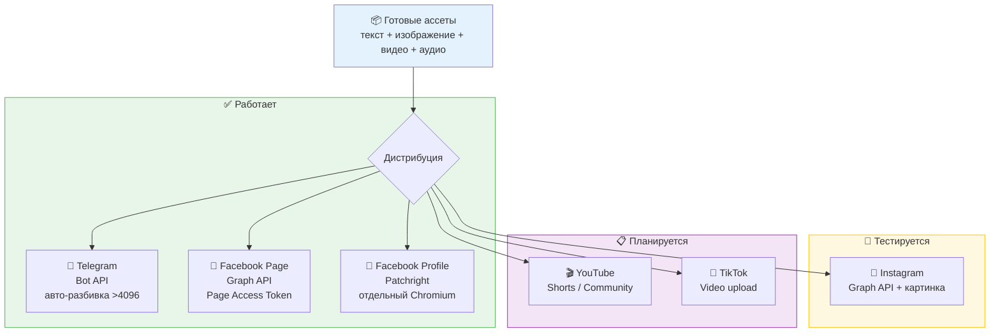
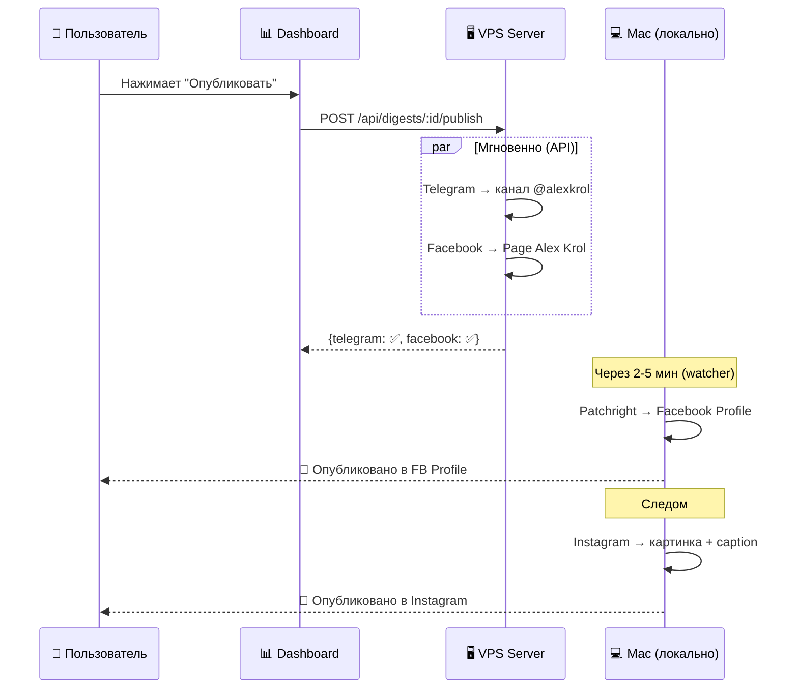

# Distribution Pipeline — Мультиплатформенная дистрибуция

**Вход:** готовые медиа-ассеты (текст, изображение, видео, аудио)  
**Выход:** опубликовано на платформах

## Архитектура



## Каналы дистрибуции

| Канал | Метод | Тип контента | Статус |
|-------|-------|-------------|--------|
| **Telegram** (@alexkrol) | Bot API | Текст | ✅ Работает |
| **Facebook Page** (Alex Krol) | Graph API | Текст | ✅ Работает |
| **Facebook Profile** | Patchright | Текст | ✅ Тестируется |
| **Instagram** (@alexeykrol) | Graph API / Patchright | Картинка + текст | 📋 Планируется |
| **YouTube** | Patchright | Видео / Community | 📋 Планируется |
| **TikTok** | API / Patchright | Видео | 📋 Планируется |

## Последовательность публикации



## Структура

```
distribution/
├── README.md               # Этот файл
├── telegram/
│   ├── telegram.js          # Publisher: Bot API + message splitting
│   └── telegram-setup.md    # Документация настройки
├── facebook-page/
│   ├── facebook.js          # Publisher: Graph API
│   └── facebook-page-setup.md
├── facebook-profile/
│   ├── fb-publish.js        # Patchright automation
│   ├── fb-profile-watcher.js # Автоматический watcher (launchd)
│   └── facebook-setup.md    # Документация (наши мытарства)
├── instagram/               # TODO
│   └── README.md
├── youtube/                 # TODO
│   └── README.md
└── tiktok/                  # TODO
    └── README.md
```

## Env переменные

```env
# Telegram
TELEGRAM_BOT_TOKEN=...
TELEGRAM_PUBLISH_CHAT_ID=-100...  # Канал (с -100 префиксом)

# Facebook Page
FACEBOOK_PAGE_ID=YOUR_FACEBOOK_PAGE_ID
FACEBOOK_PAGE_ACCESS_TOKEN=...    # Page token (не User token!)

# Facebook Profile
# Сессия хранится в .fb-profile/ (Patchright persistent context)

# Instagram (TODO)
INSTAGRAM_BUSINESS_ACCOUNT_ID=...
```
