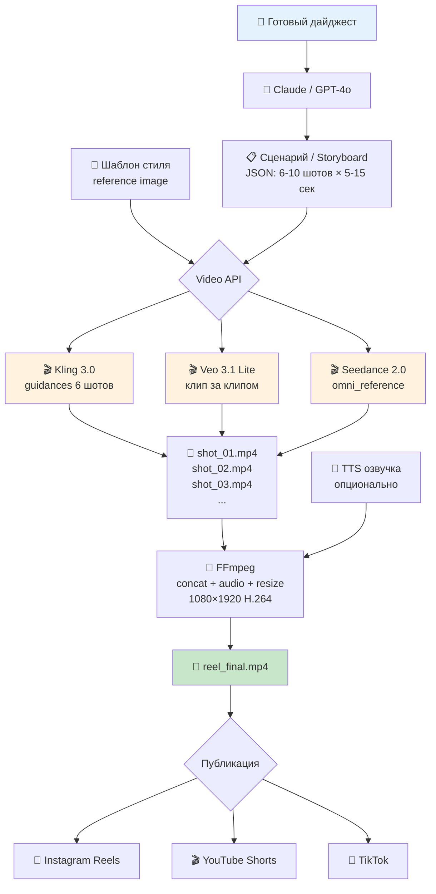

# Video Pipeline — Instagram Reels / YouTube Shorts

**Статус:** Исследование завершено, готов к реализации

## Концепция

Автоматическая генерация 15-90 секундных видео из дайджеста для Instagram Reels, YouTube Shorts, TikTok. Каждый клип — 5-15 секунд, склеивается локально через FFmpeg.

## Архитектура



## Сравнение моделей (апрель 2026)

| Модель | Storyboard API | Style ref | 9:16 | Аудио | Макс. длит. | Цена/сек | 60с Reel |
|--------|---------------|-----------|------|-------|-------------|----------|----------|
| **Kling 3.0** | ✅ 6 шотов | ✅ Elements 3.0 | ✅ | ✅ | 15 сек | $0.075 | $4.50 |
| **Veo 3.1 Lite** | ❌ | ✅ 3 ref img | ✅ | ✅ | 8 сек | $0.05-0.08 | $3.00-4.80 |
| **Seedance 2.0** | ⚠️ авто | ✅ 12 ref файлов | ✅ | ✅ | 15 сек | $0.081 | $4.86 |
| **Runway Gen-4.5** | ❌ | ✅ single ref | ✅ | ❌ | 10 сек | ~$0.12 | $7.20 |
| Wan 2.6 | ❌ | ✅ ref video | ✅ | ❌ | 15 сек | $0.071 | $4.26 |
| Sora 2 | ❌ | ⚠️ | ✅ | ✅ | 20 сек | $0.10-0.30 | $6.00+ |

## Рекомендованный стек

### Основной: Kling 3.0 (EvoLink)
- **Почему:** единственный с multi-shot `guidances[]` API — весь сторибоард за один вызов
- **Elements 3.0:** загружаем шаблон один раз → `element_id` для всех генераций
- **Нативное аудио** синхронизировано
- **$0.075/сек** через EvoLink (на 55% дешевле fal.ai)

### Резервный: Veo 3.1 Lite (Gemini API)
- **Почему:** самый дешёвый ($0.05/сек@720p), интеграция с Gemini SDK
- **Минус:** 8 сек макс., нет multi-shot, нужно больше API-вызовов

### Бюджет
- 1 Reel 60 сек/день: **$90-144/мес** (Veo Lite — Kling)
- 1 Reel 30 сек/день: **$45-68/мес**

## Пайплайн по шагам

### Шаг 1: Генерация сценария
Claude/GPT-4o из текста дайджеста создаёт JSON-сторибоард:
```json
{
  "shots": [
    {"shot": 1, "prompt": "Tech cityscape at night, glowing data streams, slow push-in", "duration": 8},
    {"shot": 2, "prompt": "Abstract network nodes connecting, deep blue tones", "duration": 7},
    {"shot": 3, "prompt": "Aerial city view at sunset, warm orange palette", "duration": 8}
  ]
}
```

### Шаг 2: Регистрация стиля
Загружаем reference-изображение (шаблон бренда) → получаем `element_id` (Kling) или передаём `reference_images` (Veo).

### Шаг 3: Параллельная генерация клипов
Все шоты генерируются параллельно через asyncio. Время: 5-15 минут.

### Шаг 4: FFmpeg сборка
```bash
ffmpeg -y -f concat -safe 0 -i concat_list.txt \
  -c:v libx264 -crf 23 -preset fast \
  -c:a aac -b:a 128k \
  -vf "scale=1080:1920:force_original_aspect_ratio=decrease,pad=1080:1920:-1:-1" \
  -movflags +faststart \
  reel_final.mp4
```

### Шаг 5: Публикация
Instagram Graph API → POST /media (video upload) → POST /media_publish

## Структура

```
distribution/video/
├── README.md                # Этот файл
├── research-video-apis.md   # Полное исследование
├── templates/               # Style reference изображения
├── output/                  # Готовые рилсы
└── src/
    ├── storyboard.js        # Claude → JSON сценарий
    ├── generate-clips.js    # Kling/Veo API → MP4 клипы
    ├── stitch.js            # FFmpeg конкатенация
    └── publish.js           # Instagram/YouTube upload
```

## Env переменные
```env
# Kling 3.0 (через EvoLink)
KLING_API_KEY=...

# Или Veo 3.1 (через Gemini)
GEMINI_API_KEY=...

# Или через fal.ai (универсальный хаб)
FAL_KEY=...
```

## Риски

- **Время генерации:** Kling 3.0 — 5-15 минут на клип. Для 60-сек рилса при параллельном запуске: ~15-20 минут
- **Стилевой дрейф:** между клипами возможны различия в стиле. Решение: Elements 3.0 + повторение ключевых слов
- **Аудио при склейке:** нативное аудио отдельных клипов может не стыковаться. Решение: отдельная аудиодорожка (TTS/музыка) поверх видео
- **Content policy:** Veo 3.1 фильтрует контент о конфликтах. Kling/Seedance мягче
