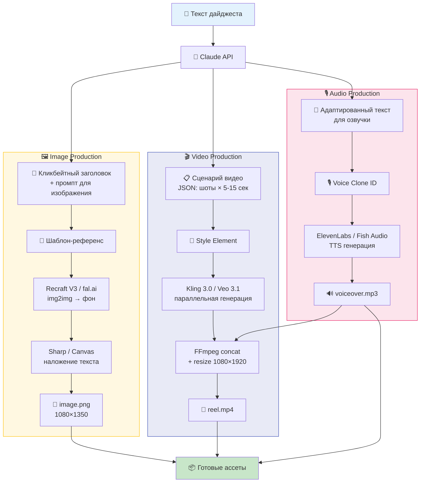

# Media Production Pipeline

**Вход:** текст дайджеста  
**Выход:** готовые медиа-ассеты (изображение, видео, аудио)

## Архитектура



## Компоненты

| Компонент | Сервис | Цена/ед | Статус |
|-----------|--------|---------|--------|
| **Image** | Recraft V3 (fal.ai) | $0.04/img | 📋 Исследование |
| **Video** | Kling 3.0 (EvoLink) | $0.075/сек | 📋 Исследование |
| **Audio** | ElevenLabs Flash v2.5 | $22/мес план | 📋 Исследование |

## Структура

```
production/
├── README.md           # Этот файл
├── image/
│   ├── README.md       # Архитектура Image pipeline
│   ├── research-image-apis.md
│   ├── templates/      # Шаблоны-референсы
│   ├── fonts/          # Шрифты для текста
│   ├── output/         # Готовые изображения
│   └── src/            # Скрипты генерации
├── video/
│   ├── README.md       # Архитектура Video pipeline
│   ├── research-video-apis.md
│   ├── templates/      # Style reference
│   ├── output/         # Готовые видео
│   └── src/            # Скрипты генерации
└── audio/
    ├── README.md       # Архитектура Audio pipeline
    ├── research-tts-apis.md
    ├── voice-samples/  # Образцы для клонирования
    └── src/            # Скрипты генерации
```
