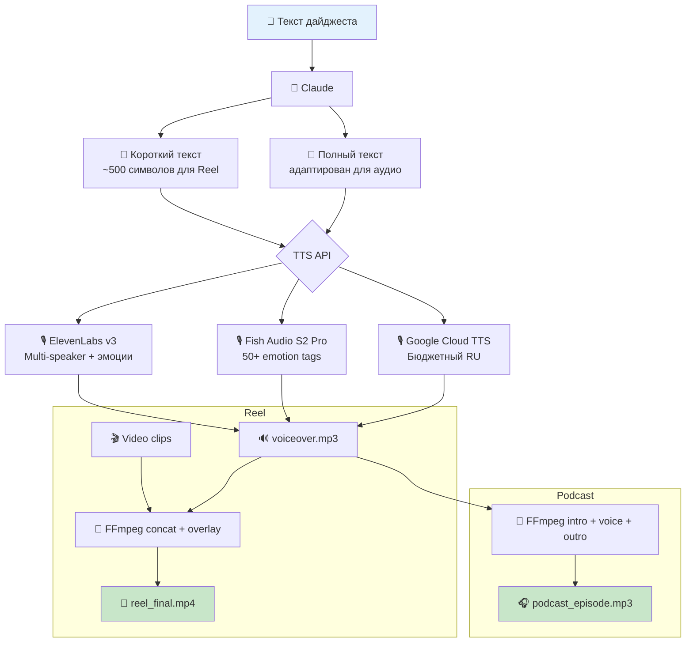

# Audio Pipeline — TTS Voice-Over для Reels + Подкаст

**Статус:** Исследование завершено, готов к реализации

## Концепция

Два сценария:
1. **Voice-over для Reels** — короткая озвучка (~500 символов) для наложения на видео
2. **Подкаст-формат** — полный текст дайджеста, intro/outro, публикация на платформы

## Архитектура



## Сравнение TTS-сервисов (апрель 2026)

| Сервис | Русский | Эмоции | Клонирование | Цена/мес (90 рилсов) | Качество |
|--------|---------|--------|-------------|---------------------|----------|
| **ElevenLabs v3** | ✅ | ✅ audio tags | ✅ из 60 сек | $22 (план) | ⭐⭐⭐⭐⭐ |
| **Fish Audio S2 Pro** | ✅ | ✅ 50+ tags | ✅ из 15 сек | ~$12 | ⭐⭐⭐⭐⭐ |
| **Inworld TTS-1.5** | ❌ | ✅ | ✅ из 5 сек | $0.45 | ⭐⭐⭐⭐⭐ |
| **Cartesia Sonic-3** | ✅ | ✅ | ✅ из 3 сек | $5 (план) | ⭐⭐⭐⭐ |
| **Voxtral TTS** | ✅ | ✅ | ✅ через API | $0.72 | ⭐⭐⭐⭐ |
| **Google Cloud TTS** | ✅ | SSML | ⚠️ Enterprise | $0.72 | ⭐⭐⭐⭐ |
| **MiniMax Speech-02** | ✅ | ✅ | ✅ $1.5/голос | $2.25 | ⭐⭐⭐⭐ |
| **Yandex SpeechKit** | ✅ нативный | SSML | ⚠️ Brand Voice | $0.50 | ⚠️ оплата из US |

## Рекомендации

| Приоритет | Сервис | Почему | Цена |
|-----------|--------|--------|------|
| **Основной** | **ElevenLabs Flash v2.5** | Multi-speaker, эмоции, Professional Clone, 70+ языков | $22/мес |
| **Бюджет + RU** | **Google Cloud TTS Neural** | Стабильный русский, SSML | $0.72/мес |
| **Качество + цена** | **Fish Audio S2 Pro** | #1 TTS-Arena2, 50+ emotion tags, cross-lingual clone | ~$12/мес |
| **Self-host** | **Resemble Chatterbox** | MIT, zero-shot clone, русский | $1-3/мес GPU |

## FFmpeg интеграция

```bash
# Voice-over на видео
ffmpeg -i reel_video.mp4 -i voiceover.mp3 \
  -filter_complex "[1:a]volume=1.5[a1];[0:a][a1]amix=inputs=2:duration=first" \
  -c:v copy reel_final.mp4

# Подкаст: intro + voice + outro
ffmpeg -i intro.mp3 -i voiceover.mp3 -i outro.mp3 \
  -filter_complex "[0:a][1:a][2:a]concat=n=3:v=0:a=1[out]" \
  -map "[out]" podcast_episode.mp3
```

## Voice Cloning (один раз)

1. Записать 1-5 минут аудио фирменным голосом
2. Загрузить в ElevenLabs → получить `voice_id`
3. Использовать `voice_id` во всех генерациях

## Структура

```
distribution/audio/
├── README.md                # Этот файл
├── research-tts-apis.md     # Полное исследование TTS API
├── voice-samples/           # Образцы для клонирования
└── src/
    ├── generate-voiceover.js
    └── overlay-audio.js     # FFmpeg wrapper
```
