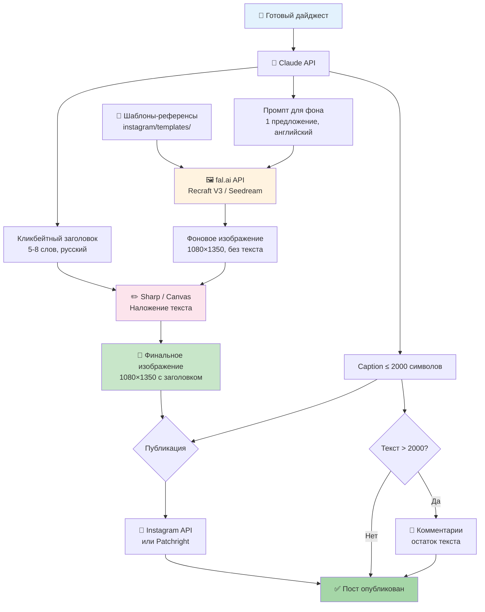

# Instagram Pipeline

## Сценарий

Когда дайджест готов и опубликован в Telegram + Facebook, нужно также опубликовать его в Instagram. Instagram — визуальная платформа, поэтому для каждого дайджеста создаётся уникальное изображение с кликбейтным заголовком.

## Полный сценарий публикации

### Вход
- Готовый дайджест (текст из БД, 2000-10000 символов)
- Набор шаблонов-референсов (2-10 изображений, задают стиль)

### Шаг 1: Генерация заголовка и промпта
**Кто:** Claude API (тот же, что генерирует дайджест)

На основе текста дайджеста Claude генерирует:
- **Кликбейтный заголовок** (5-8 слов, русский) — для наложения на изображение
- **Промпт для фона** (1 предложение, английский) — для генерации изображения
- **Сокращённый caption** (до 2000 символов) — для описания поста

Пример:
```
Заголовок: "ИИ уволил 80% отдела. Босс не жалеет."
Промпт: "Dark corporate office with empty desks and glowing screens, cinematic moody lighting"
Caption: "#новости 1. IgniteTech уволил 80% сотрудников... [первые 2000 символов]"
```

### Шаг 2: Выбор шаблона-референса
**Кто:** Скрипт (рандомный выбор)

Из папки `instagram/templates/` выбирается случайный шаблон. Шаблоны задают:
- Цветовую палитру
- Стиль (минимализм, неон, editorial и т.д.)
- Композицию (где будет текст, где фон)

### Шаг 3: Генерация фонового изображения
**Кто:** fal.ai API → Recraft V3 (или Seedream 5 Lite)

Запрос: шаблон как style reference + промпт из Шага 1
Результат: уникальное изображение 1080×1350 (4:5) в стиле шаблона
Время: ~10-15 секунд
Стоимость: ~$0.04

**Важно:** изображение БЕЗ текста — только фон/атмосфера.

### Шаг 4: Наложение текста
**Кто:** Локально, Sharp (node.js) или node-canvas

На сгенерированный фон программно накладывается:
- Кликбейтный заголовок (крупный шрифт, кириллица)
- Полупрозрачная подложка для контраста
- Логотип / бренд-элемент (опционально)

Текст накладывается **программно** — 100% контроль орфографии, шрифта, позиции.

Результат: финальное изображение 1080×1350 PNG

### Шаг 5: Подготовка caption
**Кто:** Скрипт

- Первые ~2000 символов дайджеста → caption
- Хэштеги в конце (#новости #AI #ИИ и т.д.)
- Если дайджест длиннее 2000 символов → остаток сохраняется для комментариев

### Шаг 6: Публикация в Instagram
**Кто:** Instagram Graph API или Patchright

**Вариант A — Instagram Graph API** (если аккаунт Business/Creator):
1. Загрузить изображение на публичный URL (или через контейнер)
2. POST создание media container
3. POST публикация

**Вариант B — Patchright** (если личный аккаунт):
- Тот же подход, что с Facebook Profile
- Отдельный Chromium, persistent session

### Шаг 7: Публикация остатка в комментариях
**Кто:** Instagram Graph API или Patchright

Если текст дайджеста > 2000 символов:
- Разбить остаток на части по ~2000 символов
- Опубликовать как комментарии к посту
- Задержка 30-60 секунд между комментариями

## Архитектурная схема



## Структура папки

```
instagram/
├── README.md              # Этот файл
├── templates/             # Шаблоны-референсы (PNG)
│   ├── template-01.png
│   └── template-02.png
├── output/                # Сгенерированные изображения
├── src/
│   ├── generate-image.js  # Шаг 2-4: шаблон → fal.ai → overlay текст
│   ├── prepare-caption.js # Шаг 5: текст → caption + остаток
│   └── publish.js         # Шаг 6-7: публикация + комментарии
└── fonts/                 # Шрифты для наложения текста
    └── ...
```

## Этапы реализации

| Этап | Что делаем | Статус |
|------|-----------|--------|
| 1 | Создать 2 шаблона-референса | ⬜ |
| 2 | Скрипт генерации фона через fal.ai | ⬜ |
| 3 | Скрипт наложения текста (Sharp) | ⬜ |
| 4 | Тест: промпт → изображение с текстом | ⬜ |
| 5 | Подготовка caption (разбивка, хэштеги) | ⬜ |
| 6 | Публикация в Instagram (API или Patchright) | ⬜ |
| 7 | Комментарии с остатком текста | ⬜ |
| 8 | Интеграция в основной пайплайн | ⬜ |

## Конфигурация

```env
# fal.ai
FAL_KEY=...

# Instagram (если через API)
INSTAGRAM_ACCOUNT_ID=...
INSTAGRAM_ACCESS_TOKEN=...
```

## Стоимость

| Компонент | Цена за пост | 30 постов/мес |
|-----------|-------------|---------------|
| Claude API (заголовок + промпт) | ~$0.01 | $0.30 |
| fal.ai (генерация фона) | ~$0.04 | $1.20 |
| Sharp (наложение текста) | $0 | $0 |
| **Итого** | **~$0.05** | **~$1.50** |
